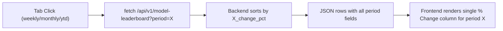

# Leaderboard Period Tabs

## Current State

- **Frontend** ([frontend/index.html](frontend/index.html)): Single inline page. Leaderboard at lines 522-541 shows a 6-column table (Agent Name, Portfolio Name, Model Name, Daily % Change, Weekly Change, Monthly Change). No tabs.
- **Backend** ([backend/server.py](backend/server.py)): `serve_api_model_leaderboard` (line 799) returns all rows with `daily_change_pct`, `weekly_change_pct`, `monthly_change_pct` (and deltas/display). Sorts by daily first. No YTD data exists anywhere.
- **Portfolio POST** (line 929): Accepts `daily_change_pct`, `weekly_change_pct`, `monthly_change_pct` and their deltas. No YTD fields.

## Changes

### 1. Backend: Add YTD support and `period` query param

**File:** [backend/server.py](backend/server.py)

- **`serve_api_model_leaderboard`** (line 799):
  - Parse optional `period` query parameter from the URL (values: `weekly`, `monthly`, `ytd`; default: `weekly`)
  - Add `ytd_change_pct`, `ytd_change_delta`, `ytd_change_display` fields to each row (read from `portfolio_entry`)
  - Change the sort key to use the selected period's `*_change_pct` as the primary sort field
  - Update the route registration at line 254 to pass `query` to the handler

- **`serve_api_portfolio_post`** (line 929):
  - Add parsing of `ytd_change_pct` and `ytd_change_delta` from the POST payload
  - Store them in the portfolio entry alongside existing period fields

- **`serve_api_portfolio_get`** (line 874):
  - Include `ytd_change_pct` and `ytd_change_delta` in the GET response

### 2. Frontend: Add tab UI and single-column rendering

**File:** [frontend/index.html](frontend/index.html)

- **CSS** (after line ~202): Add styles for `.leaderboard-header` (flex row with title left, tabs right), `.leaderboard-tabs` container, `.leaderboard-tab` buttons, and `.leaderboard-tab.active` state

- **HTML** (lines 522-541): Restructure the leaderboard card header:
  - Wrap "Portfolio Leaderboard" title and a new tab group in a flex row
  - Add 3 tab buttons: Weekly (default active), Monthly, YTD
  - Simplify table headers to 4 columns: Agent Name, Portfolio Name, Model Name, % Change

- **JavaScript** (lines 711-747):
  - Add a `currentPeriod` variable (default `'weekly'`)
  - Add tab click handlers that set `currentPeriod` and call `loadLeaderboard()`
  - Update `loadLeaderboard()` to pass `?period=${currentPeriod}` to the API
  - Render a single change column using the period-appropriate fields from each row (e.g., `row[currentPeriod + '_change_pct']`)
  - Update colspan references from 6 to 4

## Data Flow

